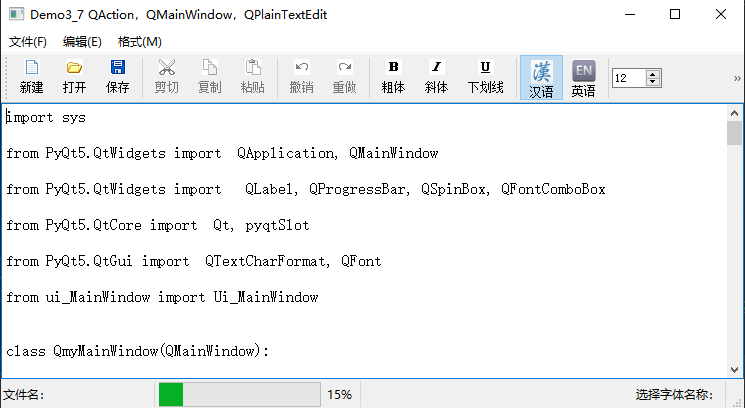

# pythonProject
# 本项目是学习pyqt-ui开发的练习文件。

## chapt3.3 是学习QSlider和QProgressBar

## chapt3.4 是学习日期时间数据

## chapt3.5 学习定时器QTimer

## chapt3.6 下拉列表框QComboBox

## chapt3.7 QMainWindow与QAction

QMainWindow是主窗体类，可以作为一个应用程序
的主窗体，具有主菜单栏、工具栏、状态栏等主窗体常
见的界面元素。

QAction是直接从QObject继承而来的一个类，不是
一个可视组件。QAction就是一个实现某些功能的“动
作”，可以为其编写槽函数，使用一个QAction对象可
以创建菜单项、工具栏按钮，点击菜单项或工具栏按钮
就执行了关联的Action的槽函数。

学习参考书为《PyQt 5快速开发与实战》
